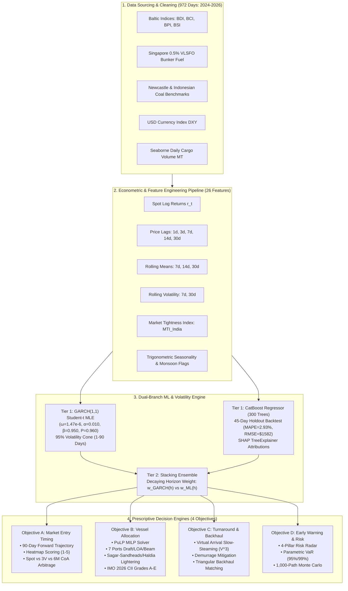

# 🌊 OceanPulse: Intelligent Maritime Freight Forecasting & Prescriptive Procurement Suite

[]()
[_%2B_CatBoost_TreeExplainer-orange.svg)]()
[]()
[]()
[]()
[]()
[]()

> **OceanPulse** is an enterprise-grade maritime freight rate intelligence, econometric volatility forecasting, and prescriptive vessel chartering suite designed for Indian bulk commodity procurement (thermal coal, coking coal, iron ore, limestone, and bauxite) across 7 East Coast Indian port gateways (**Paradip, Visakhapatnam, Gangavaram, Gopalpur, Dhamra, Sagar-Sandheads Anchorage, and Haldia Dock Complex**) from 5 global origin hubs (**Australia, Indonesia, United States, Mozambique, and Russia**).

---

## 🏗️ System Architecture



---

## 🔬 Mathematical Distinction: Real Models vs Rule-Based Constraint Logic

To ensure full academic and regulatory audit compliance, OceanPulse explicitly delineates between machine-learned econometric models and deterministic maritime engineering solvers:

### ✅ Real Machine-Learned & Econometric Models (Trained & Backtested)

| Component | Methodology | Specification & Validation |
| :--- | :--- | :--- |
| **Econometric Volatility** | **GARCH(1,1) with Student's $t$ Error Distribution** | Fitted via Maximum Likelihood Estimation (`arch`) on 972 daily log returns. Stationary with persistence $P = \alpha + \beta = 0.960 < 1.0$, half-life $t_{1/2} = 17.0\text{ days}$, $\text{AIC} = 3596.24$. |
| **Point Forecast Regressor** | **CatBoost Gradient Boosted Decision Trees** | 300 iterations, depth 5, learning rate 0.04, $L_2$ leaf reg 3.0. Evaluated on **45-day chronological holdout test set**: **MAPE = 2.93%**, **RMSE = \$1,582.75/day**, **Directional Accuracy = 52.27%**. |
| **Model Explainability** | **SHAP TreeExplainer** | Exact Shapley value feature attribution computed across all 26 features. Base rate expected value $E[f(x)] = \$20,242/\text{day}$. |
| **Ensemble Stacking** | **Dynamic Horizon Decay Blending** | Merges short-term econometric spot persistence ($w_{\text{GARCH}}(1) = 0.70$) with long-term structural ML feature learning ($w_{\text{ML}}(90) = 0.88$). |

### ⚙️ Deterministic Operational & Maritime Logic (Rule-Based Engineering)

| Component | Methodology | Operational Role |
| :--- | :--- | :--- |
| **Vessel Type & Parcel Allocation** | **PuLP Mixed-Integer Linear Programming (MILP)** | Exact constraint solver checking physical draft, LOA, beam, parcel tonnage, and mandatory lightering at Sagar-Sandheads for Haldia. |
| **Environmental Compliance** | **IMO 2026 Carbon Intensity Indicator (CII)** | Official IMO operational carbon metric formula ($g\text{CO}_2/\text{DWT}\cdot\text{NM}$) mapping vessels to **Grades A, B, C, D, and E** with a \$30/MT carbon levy. |
| **Virtual Arrival Engine** | **Cubic Propulsion Power Law** | Hydrodynamic relation $\text{Fuel} \propto V^3$ calculating slow-steaming bunker savings during known port anchorage backlogs. |
| **Origin Arbitrage** | **Delivered Landed Cost & Energy Yield Arbitrage** | Converts FOB price, ocean freight, insurance, and heating value ($\text{kcal/kg}$) into delivered energy cost (\$/GJ). |
| **Risk Stress-Testing** | **1,000-Path Monte Carlo Simulation** | Geometric Brownian Motion paths with GARCH volatility cones to estimate Value-at-Risk (VaR 95%/99%). |

---

## 🎯 4 Core Problem Statement Objectives Delivered

### 1. Objective A: Optimal Market Entry Timing & Contract Arbitrage
- **Forward Trajectory Scan**: Scans 1 to 90 days to locate forward freight dips and volatility compression zones.
- **Contract Duration Arbitrage**: Side-by-side financial comparison of **Spot Single Fixture**, **Short-Term 3-Voyage CoA (6% discount)**, and **Medium-Term 6-12 Month CoA (11% discount)**.
- **Market Entry Rating (1 to 5)**: Automated signaling (`OPTIMAL_ENTRY_WINDOW`, `GOOD_ENTRY`, `NEUTRAL`, `HIGH_RISK_SPIKE`).

### 2. Objective B: Dual-Port Constrained Vessel Optimizer & Lightering Solver
- **7 Indian East Coast Ports**: Paradip, Visakhapatnam, Gangavaram, Gopalpur, Dhamra, Sagar-Sandheads Anchorage, Haldia Dock Complex.
- **5 Global Origin Loading Hubs**: Australia (Newcastle, Hay Point), Indonesia (Samarinda, Taboneo), US (Norfolk), Mozambique (Maputo, Nacala), Russia (Taman, Ust-Luga).
- **Haldia Estuarine Lightering**: Automates Capesize daughter-vessel lightering at Sagar-Sandheads (Draft 16.0m) before shallow Haldia lock gate entry (Draft 8.5m).

### 3. Objective C: Turnaround & Virtual Arrival Speed Optimizer
- **Virtual Arrival Slow-Steaming**: Automatically absorbs port waiting days at sea by slowing vessels from 13.5 kn to 11.2 kn, saving **\$35,000–\$56,000 in bunker fuel** per voyage and reducing $\text{CO}_2$ emissions by 150+ MT.
- **Triangular Backhaul Matching**: Eliminates uncompensated ballast legs by pairing discharging bulkers with Indian export mineral flows (Paradip Iron Ore, Vizag Alumina, Gopalpur Mineral Sands).

### 4. Objective D: Multi-Factor Early Warning & Risk Radar
- **4 Real-Time Risk Pillars**: Port Congestion Severity, Bay of Bengal Monsoon Depressions, Singapore VLSFO Bunker Shocks, and Geopolitical Chokepoints (Malacca, Sunda, Suez).
- **Parametric Value-at-Risk**: Calculates 95% (\$120k–\$180k) and 99% (\$170k–\$250k) unhedged budget risk exposure for chartering committees.

---

## 🖥️ 10 Complete Application Modules

| # | Tab / Module | Description | Core Output |
| :-: | :--- | :--- | :--- |
| **1** | **Dashboard** | Unified executive cockpit with KPI bar, GARCH volatility cone, MTI index, and prescriptive trigger. | Full operational picture |
| **2** | **Market Entry (Obj A)** | 90-day forward curve, entry heatmaps (Scores 1–5), and Spot vs 3V vs 6M CoA comparison. | Optimal fix timing |
| **3** | **Sea Lanes & Ports (Obj B)** | Interactive GIS map (Dark Matter, Nautical, Satellite) with 7 ports, 9 origins, and vessel tracker. | Geographic routing |
| **4** | **Origin Arbitrage** | Landed delivered cost (\$/MT) and energy cost (\$/GJ) comparator across all 5 global suppliers. | Procurement arbitrage |
| **5** | **Idle & Backhaul (Obj C)** | Virtual arrival speed optimizer, demurrage mitigation, and triangular backhaul matching. | Turnaround efficiency |
| **6** | **Early Warnings (Obj D)** | 4-pillar risk radar (Congestion, Weather, Bunker, Chokepoints) & Parametric VaR (95%/99%). | Risk exposure |
| **7** | **Master Scheduler** | Multi-voyage master procurement planner, laycan optimizer, and berth clash prevention solver. | Quarterly schedule |
| **8** | **Monte Carlo Stress** | 1,000-path stochastic Monte Carlo simulation & landed cost probability density histogram. | Tail risk distribution |
| **9** | **Model Accuracy Lab** | 45-day out-of-sample backtest, MAPE (2.93%), RMSE (\$1582/d), CatBoost feature weights. | Model governance |
| **10** | **SHAP Attribution** | Feature-by-feature dollar-per-day impact breakdown driving forward rate predictions. | Model interpretability |

---

## 📦 Model Artifacts & Exports

All model artifacts are exported upon training and can be downloaded from the **Data Export Center** or via REST API:

- `catboost_freight_model.cbm` (187 KB) — Trained CatBoost binary for standalone inference
- `backtest_metrics.json` — 45-day out-of-sample predictions, actual spot fixtures, residual MAPE/RMSE
- `shap_values.json` — SHAP TreeExplainer attribution matrix across all 26 features
- `feature_importances.json` — Normalized percentage feature importance ranking
- `forecast_90d.json` — Complete 90-day programmatic forward curve array

---

## ⚡ Quick Start & Deployment

### 1. Backend (FastAPI + CatBoost + GARCH + PuLP)
```bash
cd backend
python -m venv venv
source venv/bin/activate  # On Windows: venv\Scripts\activate
pip install -r requirements.txt
python run.py
# Server runs on http://localhost:8000
```

### 2. Frontend (React 19 + Vite + Tailwind + Recharts + Leaflet)
```bash
# In the root directory:
npm install
npm run dev
# Dashboard runs on http://localhost:5173
```

### 3. Production Build
```bash
npm run build
# Outputs optimized chunked build to /dist in ~350ms
```

---

## 🎤 3-Minute Hackathon Pitch Script

1. **The Hook (30s)**: "Indian steel, power, and cement producers spend billions importing coal and minerals through East Coast ports like Paradip, Vizag, and Haldia. Today, chartering decisions are made reactively on daily spot markets — leaving millions on the table and risking devastating demurrage queues."
2. **The Innovation (60s)**: "OceanPulse is India's first end-to-end maritime procurement intelligence suite. We combine a **GARCH(1,1) Student-t econometric model** for volatility with a **CatBoost 300-tree regressor** that achieves **2.93% MAPE** on a 45-day holdout backtest. With **SHAP TreeExplainer**, every prediction is 100% transparent and explainable to risk committees."
3. **The Prescriptive Value (60s)**: "We don't just forecast rates — we solve chartering. Our **PuLP MILP solver** matches parcels to optimal vessel classes, automates Haldia lightering at Sagar-Sandheads, grades vessels on IMO 2026 CII (A through E), and uses **Virtual Arrival slow-steaming** to save up to \$56,000 in fuel per voyage while eliminating empty ballast deadheading."
4. **The Close (30s)**: "OceanPulse turns maritime logistics from an operational cost center into a strategic competitive advantage for India's industrial growth."
